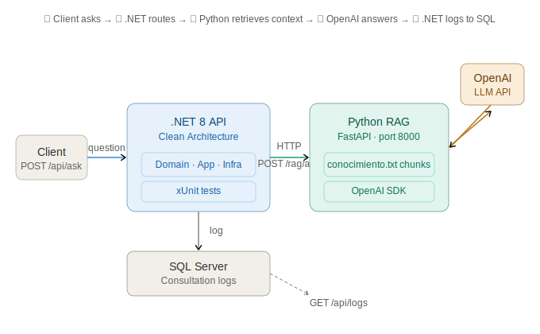

# AI RAG .NET + Python Monorepo

AI Q&A system: Python RAG (FastAPI + OpenAI) + .NET 8 Clean Architecture API + SQL Server logging + xUnit tests + GitHub Actions CI.

Recruiter-facing portfolio project showing how to integrate AI capabilities into a production-style .NET backend.

## Highlights

- Python Retrieval-Augmented Generation service built with FastAPI and OpenAI.
- .NET 8 Web API structured with Clean Architecture.
- HTTP orchestration between Python and .NET components.
- SQL Server persistence for consultation audit logs.
- Unit and integration tests with CI validation.

## Built by

Mario Ramb - Systems Engineer with 18+ years in enterprise .NET development.
This project demonstrates AI integration on top of a production-grade .NET backend.

[LinkedIn](https://www.linkedin.com/in/marioramb/) · [GitHub](https://github.com/rambmario)

## Repository Structure

```text
IA/
|-- rag-service/        # Python FastAPI RAG service
`-- DotnetRagApi/          # .NET 8 API + Clean Architecture layers + tests
```

## Tech Stack

- Python, FastAPI, OpenAI SDK, python-dotenv
- .NET 8, ASP.NET Core Web API
- SQL Server (LocalDB by default)
- xUnit for tests

## Architecture Overview

1. Client sends a question to the .NET endpoint (`POST /api/ask`).
2. .NET application invokes the Python RAG service (`POST /rag/ask`).
3. Python service retrieves relevant context from `conocimiento.txt` and calls an LLM.
4. Response returns to .NET and is persisted in SQL Server.
5. Logs can be queried from `GET /api/logs`.

## Architecture



## Prerequisites

- .NET SDK 8+
- Python 3.10+
- SQL Server LocalDB or SQL Server instance
- OpenAI API key

## Quick Start

1. Start the Python RAG service.
2. Create the SQL Server database with the provided script.
3. Run the .NET API.
4. Test the flow through Swagger or `POST /api/ask`.

## 1) Run the Python RAG Service

From `rag-service`:

```powershell
python -m venv .venv
.\.venv\Scripts\Activate.ps1
pip install -r requirements.txt
```

Create a `.env` file in `rag-service`:

```env
OPENAI_API_KEY=your_openai_api_key_here
```

Start the service:

```powershell
uvicorn app:app --host 127.0.0.1 --port 8000 --reload
```

Health endpoint:

- `GET http://127.0.0.1:8000/rag/health`

## 2) Run the .NET API

Before starting the API, create the SQL database used for audit logs.

Database script:

- `DotnetRagApi/database/create-database.sql`

Default database name:

- `DotnetRagApiDb`

Run the script in SQL Server Management Studio or with `sqlcmd` against your LocalDB / SQL Server instance.

From `DotnetRagApi`:

```powershell
dotnet restore
dotnet build
dotnet run --project .\DotnetRagApi.Api\DotnetRagApi.Api.csproj
```

Swagger:

- `http://localhost:5000/swagger`
- `https://localhost:5001/swagger`

## 3) Configure the .NET API

File: `DotnetRagApi/DotnetRagApi.Api/appsettings.json`

Check these values:

- `ConnectionStrings:DefaultConnection`
- `RagApi:BaseUrl` (default: `http://127.0.0.1:8000`)
- `RagApi:TimeoutSeconds`

Important:

- The API does not create the database automatically.
- The schema expected by the repository is `dbo.DotnetRagApiLogs`.
- If you change the database name in the script, keep `ConnectionStrings:DefaultConnection` aligned.

## 4) Run Tests

From `DotnetRagApi`:

```powershell
dotnet test .\DotnetRagApi.slnx
```

## API Endpoints

- `POST /api/ask`
- `GET /api/logs?top=50`

Example request:

```json
{
	"pregunta": "What is retrieval augmented generation?",
	"usuario": "recruiter",
	"rol": "user",
	"topN": 2
}
```

## Why It Works As A Portfolio Project

- Demonstrates practical AI integration instead of isolated toy logic.
- Applies Clean Architecture to keep business logic testable.
- Shows cross-language integration (Python + .NET).
- Includes automated tests and persistence concerns.

## Notes

- Some domain and DTO fields intentionally use Spanish naming (`pregunta`, `respuesta`) to match the business vocabulary and data contracts.
- For production hardening, next steps would include authentication, resiliency policies, and CI/CD deployment automation.
